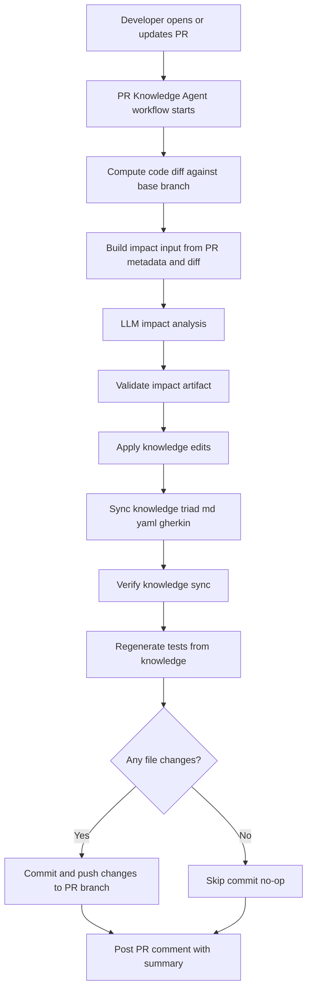

# PR Knowledge Agent Explainer

## Who This Is For
This guide explains what happens when a pull request is created and how knowledge and tests are updated automatically.

It is written for engineers who are new to this repository, including junior and mid-level developers.

## Why This Exists
In this project:
1. Knowledge files are the source of truth for product behavior.
2. Tests are generated from knowledge.
3. The PR Knowledge Agent keeps knowledge and tests aligned with code changes.

That means engineers spend less time manually updating many test files and more time reviewing meaningful behavior updates.

## Core Idea In One Sentence
When a PR changes code, an automated workflow analyzes the diff, updates impacted knowledge, regenerates tests, and commits those updates back to the PR branch.

## Trigger Modes
The PR Knowledge Agent now supports two ways to run:
1. Automatic on pull requests (`pull_request` trigger)
2. Manual from the Actions tab (`workflow_dispatch` trigger)

When to use manual run:
1. Re-run a branch without pushing a new commit
2. Demo the flow in front of stakeholders
3. Validate workflow behavior after infrastructure/config changes

## Visual Flow

## What Gets Updated
Typical files touched by the agent:
1. Knowledge markdown files in `template-project/knowledge/<feature>/<feature>.md`
2. Synchronized YAML files in `template-project/knowledge/<feature>/<feature>.yaml`
3. Synchronized Gherkin files in `template-project/knowledge/<feature>/<feature>.feature`
4. Generated UI test scaffolds in `template-project/tests/playwright/*.spec.ts`
5. Generated API test scaffolds in `template-project/tests/api/*.api.spec.ts`

## Step By Step (Human Readable)
### Step 1: Trigger
The workflow runs when a PR is opened, updated, or reopened and matching paths are changed.

It can also be started manually with Run workflow in GitHub Actions.

### Step 1.5: Precheck and Skip Decision
Before heavy processing starts, the workflow classifies the change scope and evaluates skip controls.

Skip controls:
1. PR label `skip-knowledge-agent`
2. PR marker `[skip pkac-agent]` in title or body
3. Docs-only change detection

If skip applies, the workflow posts a clear skip summary and does not run knowledge/test update stages.

### Step 2: Diff Collection
The agent compares base branch versus PR branch and extracts changed lines from source areas.

Why it matters:
This narrows the analysis to what actually changed.

### Step 3: Impact Analysis
The agent sends structured PR context to an LLM impact analyzer.

Expected output:
1. Impacted features
2. Proposed knowledge edits
3. Suggested test plan

### Step 4: Validation and Safety
The impact artifact is validated with schema and guardrails.

If validation fails:
1. The workflow can use fallback behavior.
2. Invalid output is blocked from unsafe apply.

### Step 5: Apply Knowledge Updates
Validated edits are applied to knowledge markdown files.

### Step 6: Triad Synchronization
Knowledge files are synchronized so md, yaml, and gherkin stay aligned by rule IDs.

Important principle:
Existing detailed scenario behavior should be preserved when possible, not replaced by generic placeholders.

### Step 7: Verify Sync
A sync check confirms rule IDs and rule text consistency across all three knowledge formats.

### Step 8: Generate Tests
Tests are regenerated from synchronized knowledge.

This gives deterministic traceability from behavior rules to test scaffolds.

### Step 9: Commit Back To PR
If files changed, the workflow commits and pushes to the PR branch.

If nothing changed:
The run still completes and reports a no-op summary.

### Step 10: PR Comment Summary
The agent posts or updates a PR comment describing:
1. What was analyzed
2. What changed
3. Which steps passed or failed
4. Whether the run was skipped and why

## What You Should Review In A PR
When the bot updates a PR, review these first:
1. Knowledge intent and rule correctness in feature folders
2. Whether gherkin steps remain behavior-rich and specific
3. Generated tests for rule ID traceability and meaningful TODO scaffolds
4. Bot summary comment for run context and changed file list

## Common Outcomes
### Outcome A: Changes Were Committed
Meaning:
The agent detected impacted behavior and produced concrete knowledge/test updates.

### Outcome B: No Changes Needed
Meaning:
Knowledge and tests were already aligned with the PR changes, or impact was outside tracked behavior scope.

### Outcome C: Action Required
Meaning:
Workflow approval or policy gate is pending. This is usually a process state, not a code crash.

### Outcome D: Skipped By Policy
Meaning:
The workflow intentionally skipped heavy checks because a bypass control or docs-only scope was detected.

Typical skip reasons:
1. `skip-knowledge-agent` label present
2. `[skip pkac-agent]` marker present
3. docs-only change set

## Troubleshooting Quick Guide
### Problem: Workflow is green but updates look low quality
Check:
1. Impact artifact quality
2. Sync behavior preserving scenario detail
3. Whether fallback mode generated overly generic edits

### Problem: Tests did not change
Check:
1. Did knowledge files actually change?
2. Did regenerated output match existing test files exactly?
3. Was the run a no-op by design?

### Problem: Run is action_required
Check:
1. Repository workflow approval settings
2. Whether the triggering actor needs maintainer approval

### Problem: Run was skipped unexpectedly
Check:
1. PR labels for `skip-knowledge-agent`
2. PR title/body for `[skip pkac-agent]`
3. Whether all changed files are under `docs/` or `template-project/docs/`

## Glossary
1. Knowledge triad: markdown, yaml, and gherkin files representing the same behavior.
2. Impact artifact: machine-readable output describing affected features and proposed edits.
3. No-op run: workflow succeeded, but no files required updates.

## Where To Look In The Repo
1. Workflow file: `.github/workflows/pr-knowledge-agent.yml`
2. Template workflow mirror: `template-project/.github/workflows/pr-knowledge-agent.yml`
3. Knowledge source folders: `template-project/knowledge/`
4. Generated tests: `template-project/tests/`
5. Hardening plan: `docs/pr-knowledge-agent-hardening-plan.md`

## Demo Checklist For New Mechanisms
1. Manual run test:
2. Open Actions tab and run PR Knowledge Agent with Run workflow.
3. Label skip test:
4. Add label `skip-knowledge-agent` on a PR with code changes, then push a small update.
5. Marker skip test:
6. Remove label, add `[skip pkac-agent]` to PR title/body, then push a small update.
7. Verify in PR comment:
8. skip mode
9. skip reason
10. pipeline stage statuses

## Suggested Onboarding Exercise
1. Create a tiny PR changing one validation rule in `template-project/src`.
2. Let the agent run.
3. Compare before and after in `template-project/knowledge/` and `template-project/tests/`.
4. Review the PR comment summary and map each changed file back to the flow above.
